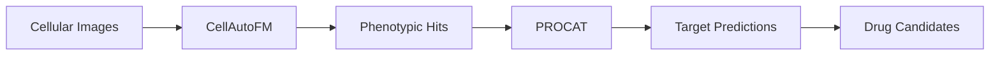

# Phenotype-Drug-Discovery

A comprehensive computational pipeline for phenotype-based drug discovery, combining automated cellular image analysis with target deconvolution to identify and characterize novel therapeutic compounds.

## Overview

This repository contains two complementary deep learning tools designed to accelerate drug discovery through phenotypic screening:

- **[CellAutoFM](./CellAutoFM/)**: Automated cell image analysis using fine-tuned Vision Transformers
- **[PROCAT](./procat_core/)**: Protein target deconvolution and characterization

Together, these tools provide an end-to-end solution for identifying promising drug candidates from cellular phenotypes and predicting their molecular targets.

## Project Components

### 🔬 CellAutoFM
**Automated Cell Image Analysis with Fine-tuned Vision Transformers**

CellAutoFM analyzes cellular autophagy images to identify compounds with desired phenotypic effects using parameter-efficient fine-tuned Vision Transformers.

### 🎯 PROCAT  
**Deep Learning-Based Target Deconvolution Framework**

PROCAT predicts protein-compound interactions for phenotypically active compounds using Graph Convolutional Networks and attention mechanisms to analyze large-scale protein libraries.

## Workflow Integration

1. **Image Analysis**: CellAutoFM processes cellular images to identify compounds with desired phenotypes
2. **Compound Selection**: Similarity analysis ranks compounds based on reference molecule profiles
3. **Target Prediction**: PROCAT analyzes selected compounds to predict molecular targets
4. **Validation**: Combined phenotypic and target information guides experimental validation

## Installation, Prerequisites, System Requirements, Applications,  Basic Usage & Support

- **CellAutoFM**: See [CellAutoFM documentation](./CellAutoFM/README.md)
- **PROCAT**: See [PROCAT documentation](./PROCAT/README.md)

Individual component citations are available in their respective README files.